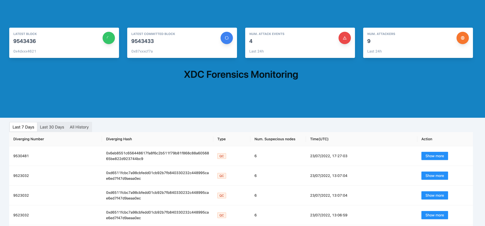

# Forensics-ui

<p align="center">
  
</p>

<p align="center">
  XDC forking detection system <br/>
  with a mission to be the most reliable blockchain
</p>
<br/>

## Dev setup
UI of XDC Forensics monitoring

```
nvm use
npm run install:clean
npm run dev
```

Go to http://localhost:8080

## Host on server
1. Install serve
```
npm install -g serve
```

2. Run the build
```
npm run start
```
It shall now runs on port 8888
